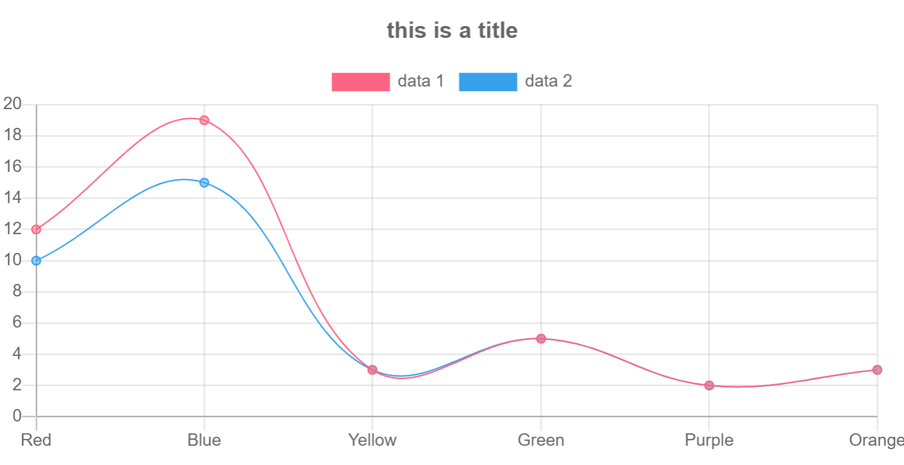
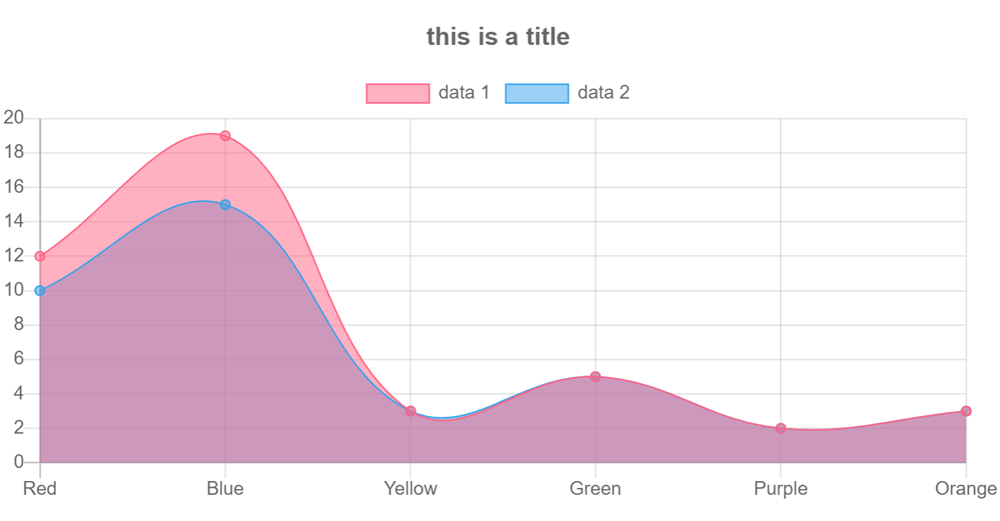
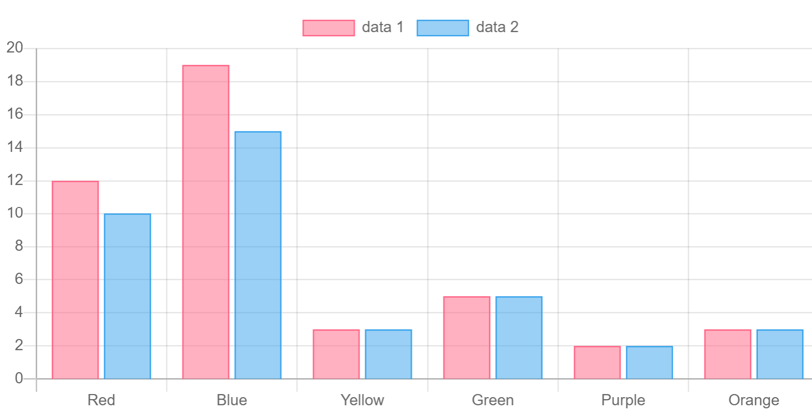
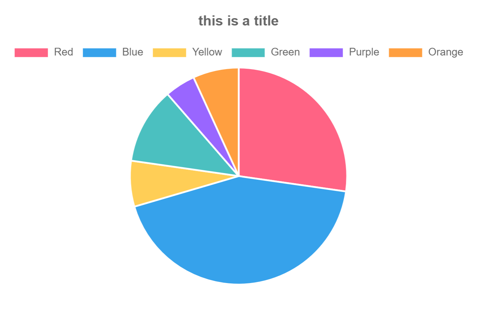

# Description

This is a wrapper of [chart.js](https://www.chartjs.org/) in php to be used in [Laravel Framework](https://laravel.com/).

This component offers an easy and fast interface to add charts to a lavaravel application.

# Setup

## Installation

Install it via composer with the command:

```
composer require vitopedro/laravel-chartjs
```

## Configuration

1 - Add the service provider to your application in your configuration file that is normally under `config/app.php`

```
...
/*
 * Application Service Providers...
 */
...
App\Providers\EventServiceProvider::class,
App\Providers\RouteServiceProvider::class,

vitopedro\chartjs\ChartjsServiceProvider::class,
...
```
2 - Test your application with `php artisan serve`, if it has errors, reset your composer qutoload with:

```
composer dump-autoload
```

3 - Publish the public assets with the the command:

```
php artisan vendor:publish --tag=public --force
```

if everything worked correctlly, you will have in your application's public folder a folder `vitopedro\chartjs`

# Usage

Include the class coresponding to the chart type nedeed, the minimum requirement for a chart to properlly render is to set the labels and the series. It is also recommended to set the title, but not mandatory.

## Line/Area/Column

Those chart types are similar and can be used interchangeblly to represent the same set of data.
In those types, the labels correspond to the points in the x axix of the chart and are required to properlly render the data. The series corresponds to the data itself, and it is an array containing in each position a label and a data positions. The label is to be used in the legend and in the tooltip of the chart, the data should be an array of numbers and should have the same length that labels has.

### Examples

#### Line chart

```
use vitopedro\chartjs\LineChart;

$line = new LineChart();
$line->setTitle("this is a title");
$line->setLabels(['Red', 'Blue', 'Yellow', 'Green', 'Purple', 'Orange']);
$line->setSeries([
    [
        'label' => 'data 1',
        'data' => [12, 19, 3, 5, 2, 3],
    ],
    [
        'label' => 'data 2',
        'data' => [10, 15, 3, 5, 2, 3],
    ],
]);
echo $line->render();

```



#### Area chart

```
use vitopedro\chartjs\AreaChart;

$area = new AreaChart();
$area->setTitle("this is a title");
$area->setLabels(['Red', 'Blue', 'Yellow', 'Green', 'Purple', 'Orange']);
$area->setSeries([
    [
        'label' => 'data 1',
        'data' => [12, 19, 3, 5, 2, 3],
    ],
    [
        'label' => 'data 2',
        'data' => [10, 15, 3, 5, 2, 3],
    ],
]);
echo $area->render();
```



#### Column chart

```
use vitopedro\chartjs\ColumnChart;

$column = new ColumnChart();
$column->setTitle("this is a title");
$column->setLabels(['Red', 'Blue', 'Yellow', 'Green', 'Purple', 'Orange']);
$column->setSeries([
    [
        'label' => 'data 1',
        'data' => [12, 19, 3, 5, 2, 3],
    ],
    [
        'label' => 'data 2',
        'data' => [10, 15, 3, 5, 2, 3],
    ],
]);
echo $column->render();
```


## Pie

This chart type differs from the the previous ones, since it doesnt have x axix. In here the labels correspond to the legend or tooltip of each value.
To create a pure pie chart only one serie should be used, if multiple series are passed to the setSeries function, multiple circles will be rendered. In the series, the label must also be sent in order to maintain consistency, but it is not rendered anywhere.

### Example

```
$area = new AreaChart();
$area->setTitle("this is a title");
$area->setLabels(['Red', 'Blue', 'Yellow', 'Green', 'Purple', 'Orange']);
$area->setSeries([
    [
        'label' => 'data 1',
        'data' => [12, 19, 3, 5, 2, 3],
    ],
    [
        'label' => 'data 2',
        'data' => [10, 15, 3, 5, 2, 3],
    ],
]);
echo $area->render();
```

